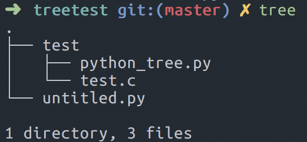

# iTeRaToR 
> 이터레이터 보고서
> 작성일 : 2018 09 03
> 작성자 : Unifox10기 박성준


> 출처 : https://nvie.com/posts/iterators-vs-generators/

> 이터레이터는 반복 가능한 객체를 뜻한다.
> 이터레이션은 이터레이터의 반복 가능한 객체에서 해당 값을 가져오는 행위이다.

## 'iter' fuction
> list, dict 타입을 이터레이터로 만들어주는 함수이다.

```python
i = [5,3,1]
print(type(i))
j = iter(i)
print(type(j))
n = 0
while n < 3:
	print(next(j)) 
	n+=1
"""
<type 'list'>
<type 'listiterator'>
5
3
1
"""
```



참고용으로 glob를 이용한 트리 구조를 이해하기 쉽게 예시로 만들어본 디렉토리다.

```
이터레이터는 next()를 호출할 때 다음 값을 생성해내는 상태를 가진 객체이다.
즉 이터레이터는 값 생성기입니다. "다음" 값을 요청할 때마다 내부 상태를 유지하고 있기 때문에 다음값을 계산하는 방법을 알고 있다.
next()를 호출할때마다 두가지 중요한 작업이 수행된다.
 1. 다음 next() 호출을 위해 상태를 변경한다. 
 2. 현재 호출에 대한 결과값을 생성한다. 
```